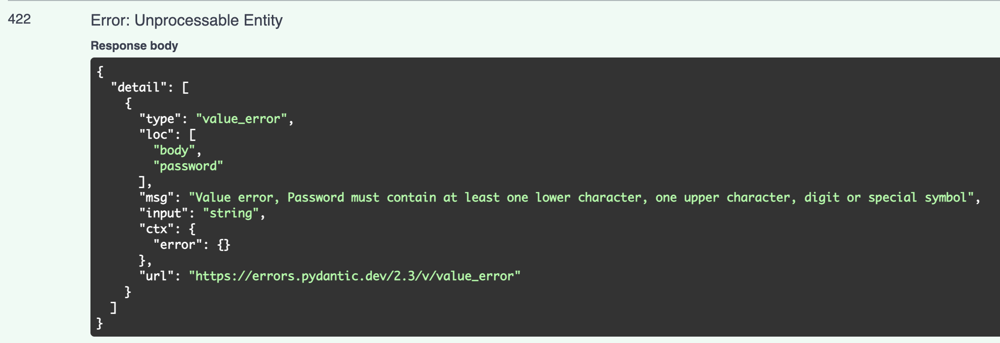
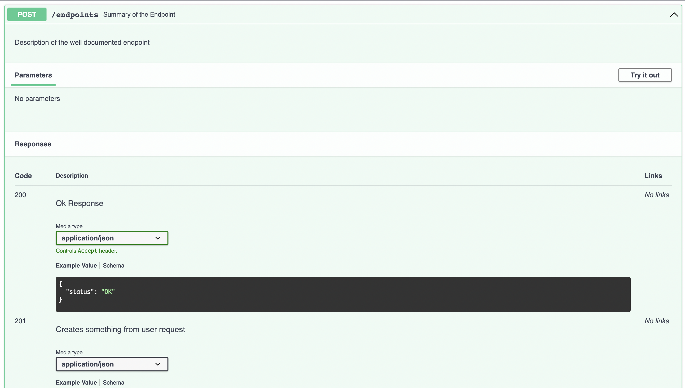

## FastAPI Best Practices <!-- omit from toc -->
Opinionated list of best practices and conventions I use in startups.

For the last several years in production,
we have been making good and bad decisions that impacted our developer experience dramatically.
Some of them are worth sharing. 

## Contents  <!-- omit from toc -->
- [Project Structure](#project-structure)
- [Async Routes](#async-routes)
  - [I/O Intensive Tasks](#io-intensive-tasks)
  - [CPU Intensive Tasks](#cpu-intensive-tasks)
- [Pydantic](#pydantic)
  - [Excessively use Pydantic](#excessively-use-pydantic)
  - [Custom Base Model](#custom-base-model)
  - [Decouple Pydantic BaseSettings](#decouple-pydantic-basesettings)
- [Dependencies](#dependencies)
  - [Beyond Dependency Injection](#beyond-dependency-injection)
  - [Chain Dependencies](#chain-dependencies)
  - [Decouple \& Reuse dependencies. Dependency calls are cached](#decouple--reuse-dependencies-dependency-calls-are-cached)
  - [Prefer `async` dependencies](#prefer-async-dependencies)
- [Miscellaneous](#miscellaneous)
  - [Follow the REST](#follow-the-rest)
  - [FastAPI response serialization](#fastapi-response-serialization)
  - [If you must use sync SDK, then run it in a thread pool.](#if-you-must-use-sync-sdk-then-run-it-in-a-thread-pool)
  - [ValueErrors might become Pydantic ValidationError](#valueerrors-might-become-pydantic-validationerror)
  - [Docs](#docs)
  - [Set DB keys naming conventions](#set-db-keys-naming-conventions)
  - [Migrations. Alembic](#migrations-alembic)
  - [Set DB naming conventions](#set-db-naming-conventions)
  - [SQL-first. Pydantic-second](#sql-first-pydantic-second)
  - [Set tests client async from day 0](#set-tests-client-async-from-day-0)
  - [Use ruff](#use-ruff)
- [Bonus Section](#bonus-section)

## Project Structure
There are many ways to structure a project, but the best structure is one that is consistent, straightforward, and free of surprises.

Many example projects and tutorials divide the project by file type (e.g., crud, routers, models), which works well for microservices or projects with fewer scopes. However, this approach didn't fit our monolith with many domains and modules.

The structure I found more scalable and evolvable for these cases is inspired by Netflix's [Dispatch](https://github.com/Netflix/dispatch), with some minor modifications.
```
fastapi-project
├── alembic/
├── src
│   ├── auth
│   │   ├── router.py
│   │   ├── schemas.py  # pydantic models
│   │   ├── models.py  # db models
│   │   ├── dependencies.py
│   │   ├── config.py  # local configs
│   │   ├── constants.py
│   │   ├── exceptions.py
│   │   ├── service.py
│   │   └── utils.py
│   ├── aws
│   │   ├── client.py  # client model for external service communication
│   │   ├── schemas.py
│   │   ├── config.py
│   │   ├── constants.py
│   │   ├── exceptions.py
│   │   └── utils.py
│   └── posts
│   │   ├── router.py
│   │   ├── schemas.py
│   │   ├── models.py
│   │   ├── dependencies.py
│   │   ├── constants.py
│   │   ├── exceptions.py
│   │   ├── service.py
│   │   └── utils.py
│   ├── config.py  # global configs
│   ├── models.py  # global models
│   ├── exceptions.py  # global exceptions
│   ├── pagination.py  # global module e.g. pagination
│   ├── database.py  # db connection related stuff
│   └── main.py
├── tests/
│   ├── auth
│   ├── aws
│   └── posts
├── templates/
│   └── index.html
├── requirements
│   ├── base.txt
│   ├── dev.txt
│   └── prod.txt
├── .env
├── .gitignore
├── logging.ini
└── alembic.ini
```
1. Store all domain directories inside `src` folder
   1. `src/` - highest level of an app, contains common models, configs, and constants, etc.
   2. `src/main.py` - root of the project, which inits the FastAPI app
2. Each package has its own router, schemas, models, etc.
   1. `router.py` - is a core of each module with all the endpoints
   2. `schemas.py` - for pydantic models
   3. `models.py` - for db models
   4. `service.py` - module specific business logic  
   5. `dependencies.py` - router dependencies
   6. `constants.py` - module specific constants and error codes
   7. `config.py` - e.g. env vars
   8. `utils.py` - non-business logic functions, e.g. response normalization, data enrichment, etc.
   9. `exceptions.py` - module specific exceptions, e.g. `PostNotFound`, `InvalidUserData`
3. When package requires services or dependencies or constants from other packages - import them with an explicit module name
```python
from src.auth import constants as auth_constants
from src.notifications import service as notification_service
from src.posts.constants import ErrorCode as PostsErrorCode  # in case we have Standard ErrorCode in constants module of each package
```

## Async Routes
FastAPI is an async framework, in the first place. It is designed to work with async I/O operations and that is the reason it is so fast. 

However, FastAPI doesn't restrict you to use only `async` routes, and the developer can use `sync` routes as well. This might confuse beginner developers into believing that they are the same, but they are not.

### I/O Intensive Tasks
Under the hood, FastAPI can [effectively handle](https://fastapi.tiangolo.com/async/#path-operation-functions) both async and sync I/O operations. 
- FastAPI runs `sync` routes in the [threadpool](https://en.wikipedia.org/wiki/Thread_pool) 
and blocking I/O operations won't stop the [event loop](https://docs.python.org/3/library/asyncio-eventloop.html) 
from executing the tasks. 
- If the route is defined `async` then it's called regularly via `await` 
and FastAPI trusts you to do only non-blocking I/O operations.

The caveat is if you fail that trust and execute blocking operations within async routes, 
the event loop will not be able to run the next tasks until that blocking operation is done.
```python
import asyncio
import time

from fastapi import APIRouter


router = APIRouter()


@router.get("/terrible-ping")
async def terrible_ping():
    time.sleep(10) # I/O blocking operation for 10 seconds, the whole process will be blocked
    
    return {"pong": True}

@router.get("/good-ping")
def good_ping():
    time.sleep(10) # I/O blocking operation for 10 seconds, but in a separate thread for the whole `good_ping` route

    return {"pong": True}

@router.get("/perfect-ping")
async def perfect_ping():
    await asyncio.sleep(10) # non-blocking I/O operation

    return {"pong": True}

```
**What happens when we call:**
1. `GET /terrible-ping`
   1. FastAPI server receives a request and starts handling it 
   2. Server's event loop and all the tasks in the queue will be waiting until `time.sleep()` is finished
      1. Server thinks `time.sleep()` is not an I/O task, so it waits until it is finished
      2. Server won't accept any new requests while waiting
   3. Server returns the response. 
      1. After a response, server starts accepting new requests
2. `GET /good-ping`
   1. FastAPI server receives a request and starts handling it
   2. FastAPI sends the whole route `good_ping` to the threadpool, where a worker thread will run the function
   3. While `good_ping` is being executed, event loop selects next tasks from the queue and works on them (e.g. accept new request, call db)
      - Independently of main thread (i.e. our FastAPI app), 
        worker thread will be waiting for `time.sleep` to finish.
      - Sync operation blocks only the side thread, not the main one.
   4. When `good_ping` finishes its work, server returns a response to the client
3. `GET /perfect-ping`
   1. FastAPI server receives a request and starts handling it
   2. FastAPI awaits `asyncio.sleep(10)`
   3. Event loop selects next tasks from the queue and works on them (e.g. accept new request, call db)
   4. When `asyncio.sleep(10)` is done, servers finishes the execution of the route and returns a response to the client

> [!WARNING]
> Notes on the thread pool:
> - Threads require more resources than coroutines, so they are not as cheap as async I/O operations.
> - Thread pool has a limited number of threads, i.e. you might run out of threads and your app will become slow. [Read more](https://github.com/Kludex/fastapi-tips?tab=readme-ov-file#2-be-careful-with-non-async-functions) (external link)

### CPU Intensive Tasks
The second caveat is that operations that are non-blocking awaitables or are sent to the thread pool must be I/O intensive tasks (e.g. open file, db call, external API call).
- Awaiting CPU-intensive tasks (e.g. heavy calculations, data processing, video transcoding) is worthless since the CPU has to work to finish the tasks, 
while I/O operations are external and server does nothing while waiting for that operations to finish, thus it can go to the next tasks.
- Running CPU-intensive tasks in other threads also isn't effective, because of [GIL](https://realpython.com/python-gil/). 
In short, GIL allows only one thread to work at a time, which makes it useless for CPU tasks. 
- If you want to optimize CPU intensive tasks you should send them to workers in another process.

**Related StackOverflow questions of confused users**
1. https://stackoverflow.com/questions/62976648/architecture-flask-vs-fastapi/70309597#70309597
   - Here you can also check [my answer](https://stackoverflow.com/a/70309597/6927498)
2. https://stackoverflow.com/questions/65342833/fastapi-uploadfile-is-slow-compared-to-flask
3. https://stackoverflow.com/questions/71516140/fastapi-runs-api-calls-in-serial-instead-of-parallel-fashion

## Pydantic
### Excessively use Pydantic
Pydantic has a rich set of features to validate and transform data. 

In addition to regular features like required & non-required fields with default values, 
Pydantic has built-in comprehensive data processing tools like regex, enums, strings manipulation, emails validation, etc.
```python
from enum import Enum
from pydantic import AnyUrl, BaseModel, EmailStr, Field


class MusicBand(str, Enum):
   AEROSMITH = "AEROSMITH"
   QUEEN = "QUEEN"
   ACDC = "AC/DC"


class UserBase(BaseModel):
    first_name: str = Field(min_length=1, max_length=128)
    username: str = Field(min_length=1, max_length=128, pattern="^[A-Za-z0-9-_]+$")
    email: EmailStr
    age: int = Field(ge=18, default=None)  # must be greater or equal to 18
    favorite_band: MusicBand | None = None  # only "AEROSMITH", "QUEEN", "AC/DC" values are allowed to be inputted
    website: AnyUrl | None = None
```
### Custom Base Model
Having a controllable global base model allows us to customize all the models within the app. For instance, we can enforce a standard datetime format or introduce a common method for all subclasses of the base model.
```python
from datetime import datetime
from zoneinfo import ZoneInfo

from fastapi.encoders import jsonable_encoder
from pydantic import BaseModel, ConfigDict


def datetime_to_gmt_str(dt: datetime) -> str:
    if not dt.tzinfo:
        dt = dt.replace(tzinfo=ZoneInfo("UTC"))

    return dt.strftime("%Y-%m-%dT%H:%M:%S%z")


class CustomModel(BaseModel):
    model_config = ConfigDict(
        json_encoders={datetime: datetime_to_gmt_str},
        populate_by_name=True,
    )

    def serializable_dict(self, **kwargs):
        """Return a dict which contains only serializable fields."""
        default_dict = self.model_dump()

        return jsonable_encoder(default_dict)


```
In the example above, we have decided to create a global base model that:
- Serializes all datetime fields to a standard format with an explicit timezone
- Provides a method to return a dict with only serializable fields
### Decouple Pydantic BaseSettings
BaseSettings was a great innovation for reading environment variables, but having a single BaseSettings for the whole app can become messy over time. To improve maintainability and organization, we have split the BaseSettings across different modules and domains.
```python
# src.auth.config
from datetime import timedelta

from pydantic_settings import BaseSettings


class AuthConfig(BaseSettings):
    JWT_ALG: str
    JWT_SECRET: str
    JWT_EXP: int = 5  # minutes

    REFRESH_TOKEN_KEY: str
    REFRESH_TOKEN_EXP: timedelta = timedelta(days=30)

    SECURE_COOKIES: bool = True


auth_settings = AuthConfig()


# src.config
from pydantic import PostgresDsn, RedisDsn, model_validator
from pydantic_settings import BaseSettings

from src.constants import Environment


class Config(BaseSettings):
    DATABASE_URL: PostgresDsn
    REDIS_URL: RedisDsn

    SITE_DOMAIN: str = "myapp.com"

    ENVIRONMENT: Environment = Environment.PRODUCTION

    SENTRY_DSN: str | None = None

    CORS_ORIGINS: list[str]
    CORS_ORIGINS_REGEX: str | None = None
    CORS_HEADERS: list[str]

    APP_VERSION: str = "1.0"


settings = Config()

```

## Dependencies
### Beyond Dependency Injection
Pydantic is a great schema validator, but for complex validations that involve calling a database or external services, it is not sufficient.

FastAPI documentation mostly presents dependencies as DI for endpoints, but they are also excellent for request validation.

Dependencies can be used to validate data against database constraints (e.g., checking if an email already exists, ensuring a user is found, etc.).
```python
# dependencies.py
async def valid_post_id(post_id: UUID4) -> dict[str, Any]:
    post = await service.get_by_id(post_id)
    if not post:
        raise PostNotFound()

    return post


# router.py
@router.get("/posts/{post_id}", response_model=PostResponse)
async def get_post_by_id(post: dict[str, Any] = Depends(valid_post_id)):
    return post


@router.put("/posts/{post_id}", response_model=PostResponse)
async def update_post(
    update_data: PostUpdate,  
    post: dict[str, Any] = Depends(valid_post_id), 
):
    updated_post = await service.update(id=post["id"], data=update_data)
    return updated_post


@router.get("/posts/{post_id}/reviews", response_model=list[ReviewsResponse])
async def get_post_reviews(post: dict[str, Any] = Depends(valid_post_id)):
    post_reviews = await reviews_service.get_by_post_id(post["id"])
    return post_reviews
```
If we didn't put data validation to dependency, we would have to validate `post_id` exists
for every endpoint and write the same tests for each of them. 

### Chain Dependencies
Dependencies can use other dependencies and avoid code repetition for the similar logic.
```python
# dependencies.py
from fastapi.security import OAuth2PasswordBearer
from jose import JWTError, jwt

async def valid_post_id(post_id: UUID4) -> dict[str, Any]:
    post = await service.get_by_id(post_id)
    if not post:
        raise PostNotFound()

    return post


async def parse_jwt_data(
    token: str = Depends(OAuth2PasswordBearer(tokenUrl="/auth/token"))
) -> dict[str, Any]:
    try:
        payload = jwt.decode(token, "JWT_SECRET", algorithms=["HS256"])
    except JWTError:
        raise InvalidCredentials()

    return {"user_id": payload["id"]}


async def valid_owned_post(
    post: dict[str, Any] = Depends(valid_post_id), 
    token_data: dict[str, Any] = Depends(parse_jwt_data),
) -> dict[str, Any]:
    if post["creator_id"] != token_data["user_id"]:
        raise UserNotOwner()

    return post

# router.py
@router.get("/users/{user_id}/posts/{post_id}", response_model=PostResponse)
async def get_user_post(post: dict[str, Any] = Depends(valid_owned_post)):
    return post

```
### Decouple & Reuse dependencies. Dependency calls are cached
Dependencies can be reused multiple times, and they won't be recalculated - FastAPI caches dependency's result within a request's scope by default,
i.e. if `valid_post_id` gets called multiple times in one route, it will be called only once.

Knowing this, we can decouple dependencies onto multiple smaller functions that operate on a smaller domain and are easier to reuse in other routes.
For example, in the code below we are using `parse_jwt_data` three times:
1. `valid_owned_post`
2. `valid_active_creator`
3. `get_user_post`,

but `parse_jwt_data` is called only once, in the very first call.

```python
# dependencies.py
from fastapi import BackgroundTasks
from fastapi.security import OAuth2PasswordBearer
from jose import JWTError, jwt

async def valid_post_id(post_id: UUID4) -> Mapping:
    post = await service.get_by_id(post_id)
    if not post:
        raise PostNotFound()

    return post


async def parse_jwt_data(
    token: str = Depends(OAuth2PasswordBearer(tokenUrl="/auth/token"))
) -> dict:
    try:
        payload = jwt.decode(token, "JWT_SECRET", algorithms=["HS256"])
    except JWTError:
        raise InvalidCredentials()

    return {"user_id": payload["id"]}


async def valid_owned_post(
    post: Mapping = Depends(valid_post_id), 
    token_data: dict = Depends(parse_jwt_data),
) -> Mapping:
    if post["creator_id"] != token_data["user_id"]:
        raise UserNotOwner()

    return post


async def valid_active_creator(
    token_data: dict = Depends(parse_jwt_data),
):
    user = await users_service.get_by_id(token_data["user_id"])
    if not user["is_active"]:
        raise UserIsBanned()
    
    if not user["is_creator"]:
       raise UserNotCreator()
    
    return user
        

# router.py
@router.get("/users/{user_id}/posts/{post_id}", response_model=PostResponse)
async def get_user_post(
    worker: BackgroundTasks,
    post: Mapping = Depends(valid_owned_post),
    user: Mapping = Depends(valid_active_creator),
):
    """Get post that belong the active user."""
    worker.add_task(notifications_service.send_email, user["id"])
    return post

```

### Prefer `async` dependencies
FastAPI supports both `sync` and `async` dependencies, and there is a temptation to use `sync` dependencies, when you don't have to await anything, but that might not be the best choice.

Just as with routes, `sync` dependencies are run in the thread pool. And threads here also come with a price and limitations, that are redundant, if you just make a small non-I/O operation.

[See more](https://github.com/Kludex/fastapi-tips?tab=readme-ov-file#9-your-dependencies-may-be-running-on-threads) (external link)


## Miscellaneous
### Follow the REST
Developing RESTful API makes it easier to reuse dependencies in routes like these:
   1. `GET /courses/:course_id`
   2. `GET /courses/:course_id/chapters/:chapter_id/lessons`
   3. `GET /chapters/:chapter_id`

The only caveat is to use the same variable names in the path:
- If you have two endpoints `GET /profiles/:profile_id` and `GET /creators/:creator_id`
that both validate whether the given `profile_id` exists,  but `GET /creators/:creator_id`
also checks if the profile is creator, then it's better to rename `creator_id` path variable to `profile_id` and chain those two dependencies.
```python
# src.profiles.dependencies
async def valid_profile_id(profile_id: UUID4) -> Mapping:
    profile = await service.get_by_id(profile_id)
    if not profile:
        raise ProfileNotFound()

    return profile

# src.creators.dependencies
async def valid_creator_id(profile: Mapping = Depends(valid_profile_id)) -> Mapping:
    if not profile["is_creator"]:
       raise ProfileNotCreator()

    return profile

# src.profiles.router.py
@router.get("/profiles/{profile_id}", response_model=ProfileResponse)
async def get_user_profile_by_id(profile: Mapping = Depends(valid_profile_id)):
    """Get profile by id."""
    return profile

# src.creators.router.py
@router.get("/creators/{profile_id}", response_model=ProfileResponse)
async def get_user_profile_by_id(
     creator_profile: Mapping = Depends(valid_creator_id)
):
    """Get creator's profile by id."""
    return creator_profile

```
### FastAPI response serialization
If you think you can return Pydantic object that matches your route's `response_model` to make some optimizations,
then it's wrong. 

FastAPI firstly converts that pydantic object to dict with its `jsonable_encoder`, then validates 
data with your `response_model`, and only then serializes your object to JSON. 
```python
from fastapi import FastAPI
from pydantic import BaseModel, root_validator

app = FastAPI()


class ProfileResponse(BaseModel):
    @model_validator(mode="after")
    def debug_usage(self):
        print("created pydantic model")

        return self


@app.get("/", response_model=ProfileResponse)
async def root():
    return ProfileResponse()
```
**Logs Output:**
```
[INFO] [2022-08-28 12:00:00.000000] created pydantic model
[INFO] [2022-08-28 12:00:00.000020] created pydantic model
```

### If you must use sync SDK, then run it in a thread pool.
If you must use a library to interact with external services, and it's not `async`,
then make the HTTP calls in an external worker thread.

We can use the well-known `run_in_threadpool` from starlette.
```python
from fastapi import FastAPI
from fastapi.concurrency import run_in_threadpool
from my_sync_library import SyncAPIClient 

app = FastAPI()


@app.get("/")
async def call_my_sync_library():
    my_data = await service.get_my_data()

    client = SyncAPIClient()
    await run_in_threadpool(client.make_request, data=my_data)
```

### ValueErrors might become Pydantic ValidationError
If you raise a `ValueError` in a Pydantic schema that is directly faced by the client, it will return a nice detailed response to users.
```python
# src.profiles.schemas
from pydantic import BaseModel, field_validator

class ProfileCreate(BaseModel):
    username: str
    
    @field_validator("password", mode="after")
    @classmethod
    def valid_password(cls, password: str) -> str:
        if not re.match(STRONG_PASSWORD_PATTERN, password):
            raise ValueError(
                "Password must contain at least "
                "one lower character, "
                "one upper character, "
                "digit or "
                "special symbol"
            )

        return password


# src.profiles.routes
from fastapi import APIRouter

router = APIRouter()


@router.post("/profiles")
async def get_creator_posts(profile_data: ProfileCreate):
   pass
```
**Response Example:**



### Docs
1. Unless your API is public, hide docs by default. Show it explicitly on the selected envs only.
```python
from fastapi import FastAPI
from starlette.config import Config

config = Config(".env")  # parse .env file for env variables

ENVIRONMENT = config("ENVIRONMENT")  # get current env name
SHOW_DOCS_ENVIRONMENT = ("local", "staging")  # explicit list of allowed envs

app_configs = {"title": "My Cool API"}
if ENVIRONMENT not in SHOW_DOCS_ENVIRONMENT:
   app_configs["openapi_url"] = None  # set url for docs as null

app = FastAPI(**app_configs)
```
2. Help FastAPI to generate an easy-to-understand docs
   1. Set `response_model`, `status_code`, `description`, etc.
   2. If models and statuses vary, use `responses` route attribute to add docs for different responses
```python
from fastapi import APIRouter, status

router = APIRouter()

@router.post(
    "/endpoints",
    response_model=DefaultResponseModel,  # default response pydantic model 
    status_code=status.HTTP_201_CREATED,  # default status code
    description="Description of the well documented endpoint",
    tags=["Endpoint Category"],
    summary="Summary of the Endpoint",
    responses={
        status.HTTP_200_OK: {
            "model": OkResponse, # custom pydantic model for 200 response
            "description": "Ok Response",
        },
        status.HTTP_201_CREATED: {
            "model": CreatedResponse,  # custom pydantic model for 201 response
            "description": "Creates something from user request ",
        },
        status.HTTP_202_ACCEPTED: {
            "model": AcceptedResponse,  # custom pydantic model for 202 response
            "description": "Accepts request and handles it later",
        },
    },
)
async def documented_route():
    pass
```
Will generate docs like this:


### Set DB keys naming conventions
Explicitly setting the indexes' namings according to your database's convention is preferable over sqlalchemy's. 
```python
from sqlalchemy import MetaData

POSTGRES_INDEXES_NAMING_CONVENTION = {
    "ix": "%(column_0_label)s_idx",
    "uq": "%(table_name)s_%(column_0_name)s_key",
    "ck": "%(table_name)s_%(constraint_name)s_check",
    "fk": "%(table_name)s_%(column_0_name)s_fkey",
    "pk": "%(table_name)s_pkey",
}
metadata = MetaData(naming_convention=POSTGRES_INDEXES_NAMING_CONVENTION)
```
### Migrations. Alembic
1. Migrations must be static and revertable.
If your migrations depend on dynamically generated data, then 
make sure the only thing that is dynamic is the data itself, not its structure.
2. Generate migrations with descriptive names & slugs. Slug is required and should explain the changes.
3. Set human-readable file template for new migrations. We use `*date*_*slug*.py` pattern, e.g. `2022-08-24_post_content_idx.py`
```
# alembic.ini
file_template = %%(year)d-%%(month).2d-%%(day).2d_%%(slug)s
```
### Set DB naming conventions
Being consistent with names is important. Some rules we followed:
1. lower_case_snake
2. singular form (e.g. `post`, `post_like`, `user_playlist`)
3. group similar tables with module prefix, e.g. `payment_account`, `payment_bill`, `post`, `post_like`
4. stay consistent across tables, but concrete namings are ok, e.g.
   1. use `profile_id` in all tables, but if some of them need only profiles that are creators, use `creator_id`
   2. use `post_id` for all abstract tables like `post_like`, `post_view`, but use concrete naming in relevant modules like `course_id` in `chapters.course_id`
5. `_at` suffix for datetime
6. `_date` suffix for date
### SQL-first. Pydantic-second
- Usually, database handles data processing much faster and cleaner than CPython will ever do. 
- It's preferable to do all the complex joins and simple data manipulations with SQL.
- It's preferable to aggregate JSONs in DB for responses with nested objects.
```python
# src.posts.service
from typing import Any

from pydantic import UUID4
from sqlalchemy import desc, func, select, text
from sqlalchemy.sql.functions import coalesce

from src.database import database, posts, profiles, post_review, products

async def get_posts(
    creator_id: UUID4, *, limit: int = 10, offset: int = 0
) -> list[dict[str, Any]]: 
    select_query = (
        select(
            (
                posts.c.id,
                posts.c.slug,
                posts.c.title,
                func.json_build_object(
                   text("'id', profiles.id"),
                   text("'first_name', profiles.first_name"),
                   text("'last_name', profiles.last_name"),
                   text("'username', profiles.username"),
                ).label("creator"),
            )
        )
        .select_from(posts.join(profiles, posts.c.owner_id == profiles.c.id))
        .where(posts.c.owner_id == creator_id)
        .limit(limit)
        .offset(offset)
        .group_by(
            posts.c.id,
            posts.c.type,
            posts.c.slug,
            posts.c.title,
            profiles.c.id,
            profiles.c.first_name,
            profiles.c.last_name,
            profiles.c.username,
            profiles.c.avatar,
        )
        .order_by(
            desc(coalesce(posts.c.updated_at, posts.c.published_at, posts.c.created_at))
        )
    )
    
    return await database.fetch_all(select_query)

# src.posts.schemas
from typing import Any

from pydantic import BaseModel, UUID4

   
class Creator(BaseModel):
    id: UUID4
    first_name: str
    last_name: str
    username: str


class Post(BaseModel):
    id: UUID4
    slug: str
    title: str
    creator: Creator

    
# src.posts.router
from fastapi import APIRouter, Depends

router = APIRouter()


@router.get("/creators/{creator_id}/posts", response_model=list[Post])
async def get_creator_posts(creator: dict[str, Any] = Depends(valid_creator_id)):
   posts = await service.get_posts(creator["id"])

   return posts
```
### Set tests client async from day 0
Writing integration tests with DB will most likely lead to messed up event loop errors in the future.
Set the async test client immediately, e.g. [httpx](https://github.com/encode/starlette/issues/652)
```python
import pytest
from async_asgi_testclient import TestClient

from src.main import app  # inited FastAPI app


@pytest.fixture
async def client() -> AsyncGenerator[TestClient, None]:
    host, port = "127.0.0.1", "9000"

    async with AsyncClient(transport=ASGITransport(app=app, client=(host, port)), base_url="http://test") as client:
        yield client


@pytest.mark.asyncio
async def test_create_post(client: TestClient):
    resp = await client.post("/posts")

    assert resp.status_code == 201
```
Unless you have sync db connections (excuse me?) or aren't planning to write integration tests.

### Use ruff
With linters, you can forget about formatting the code and focus on writing the business logic.

[Ruff](https://github.com/astral-sh/ruff) is "blazingly-fast" new linter that replaces black, autoflake, isort, and supports more than 600 lint rules.

It's a popular good practice to use pre-commit hooks, but just using the script was ok for us.
```shell
#!/bin/sh -e
set -x

ruff check --fix src
ruff format src
```

## Bonus Section
Some very kind people shared their own experience and best practices that are definitely worth reading.
Check them out at [issues](https://github.com/zhanymkanov/fastapi-best-practices/issues) section of the project.

For instance, [lowercase00](https://github.com/zhanymkanov/fastapi-best-practices/issues/4) 
has described in details their best practices working with permissions & auth, class-based services & views, 
task queues, custom response serializers, configuration with dynaconf, etc.  

If you have something to share about your experience working with FastAPI, whether it's good or bad, 
you are very welcome to create a new issue. It is our pleasure to read it. 
