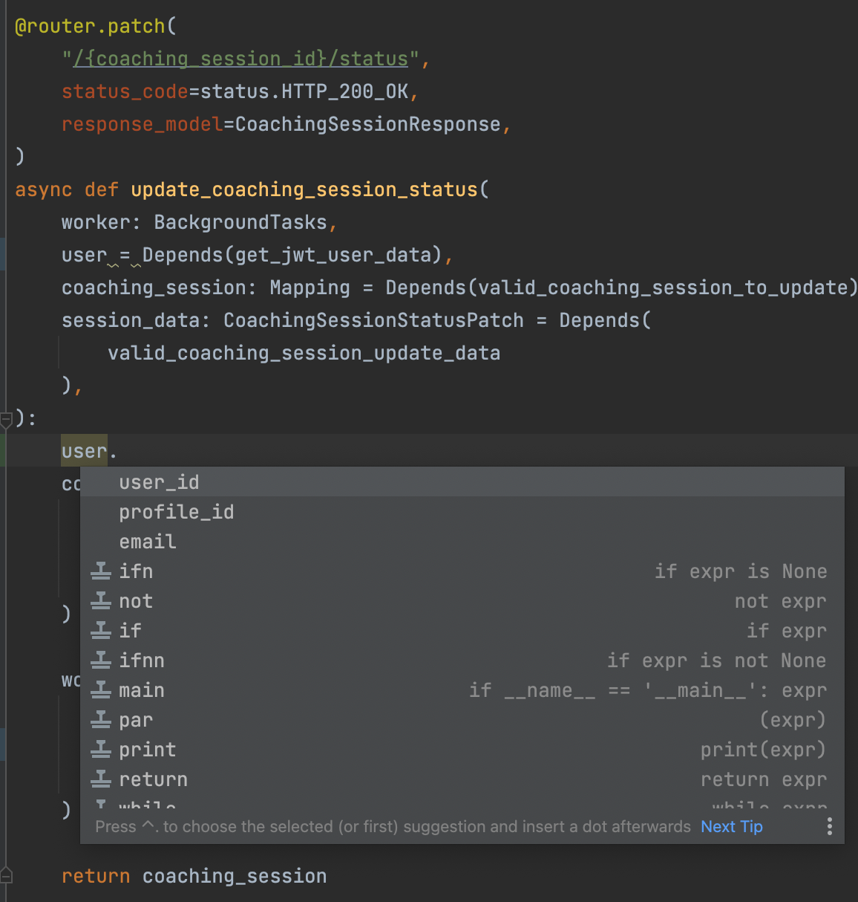
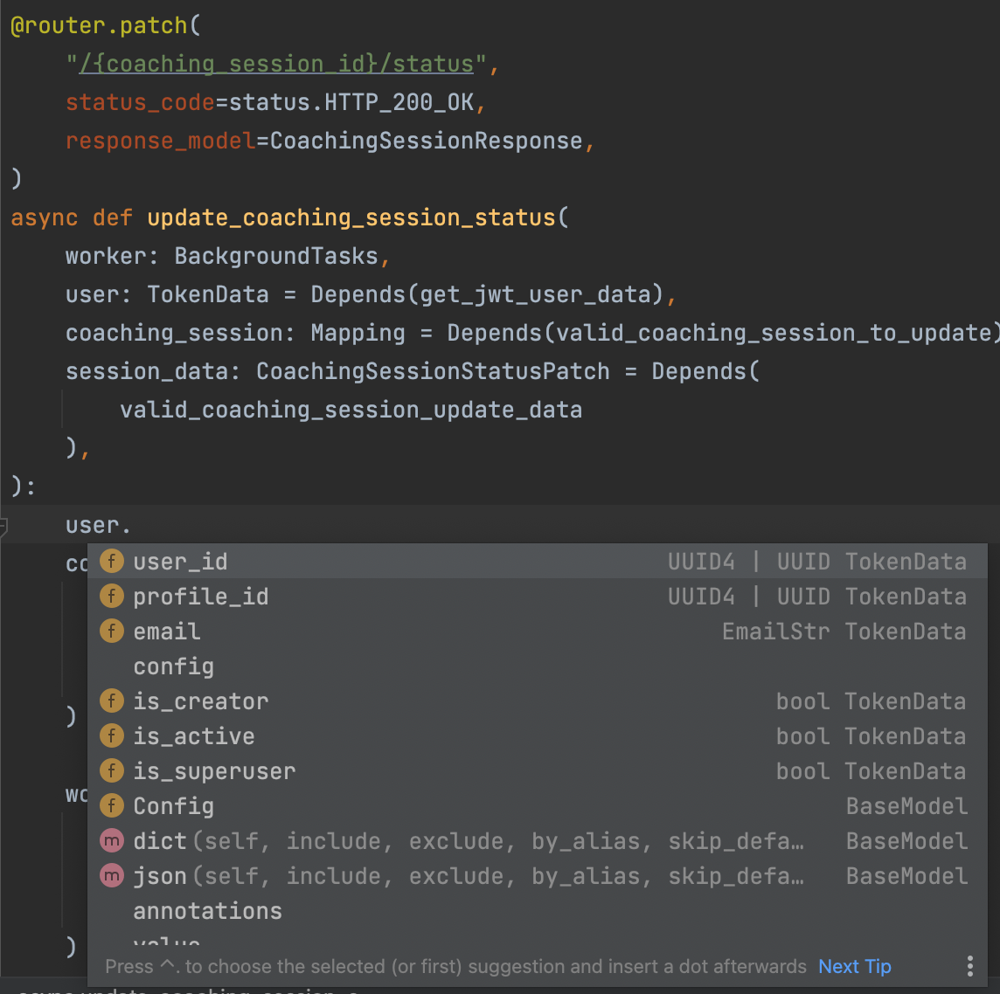
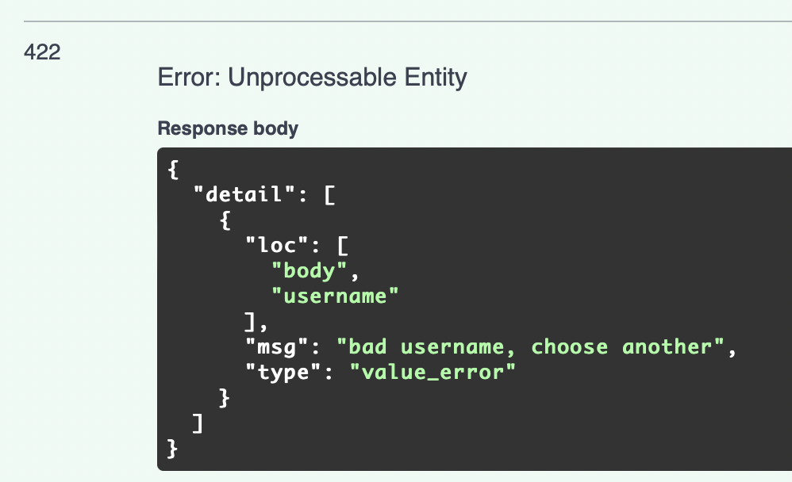

## FastAPI Best Practices
Opinionated list of best practices and conventions we used at our startup.

For the last 1.5 years in production,
we have been making good and bad decisions that impacted our developer experience dramatically.
Some of them are worth sharing. 

### Contents
1. [Project Structure. Consistent & predictable.](https://github.com/zhanymkanov/fastapi-best-practices#1-project-structure-consistent--predictable)
2. [Excessively use Pydantic for data validation.](https://github.com/zhanymkanov/fastapi-best-practices#2-excessively-use-pydantic-for-data-validation)
3. [Use dependencies for data validation vs DB.](https://github.com/zhanymkanov/fastapi-best-practices#3-use-dependencies-for-data-validation-vs-db)
4. [Chain dependencies.](https://github.com/zhanymkanov/fastapi-best-practices#4-chain-dependencies)
5. [Decouple & Reuse dependencies. Dependency calls are cached.](https://github.com/zhanymkanov/fastapi-best-practices#5-decouple--reuse-dependencies-dependency-calls-are-cached)
6. [Follow the REST.](https://github.com/zhanymkanov/fastapi-best-practices#6-follow-the-rest)
7. [Don't make your routes async, if you have only blocking I/O operations.](https://github.com/zhanymkanov/fastapi-best-practices#7-dont-make-your-routes-async-if-you-have-only-blocking-io-operations)
8. [Custom base model from day 0.](https://github.com/zhanymkanov/fastapi-best-practices#8-custom-base-model-from-day-0)
9. [Docs.](https://github.com/zhanymkanov/fastapi-best-practices#9-docs)
10. [Use Pydantic's BaseSettings for configs.](https://github.com/zhanymkanov/fastapi-best-practices#10-use-pydantics-basesettings-for-configs)
11. [SQLAlchemy: Set DB keys naming convention.](https://github.com/zhanymkanov/fastapi-best-practices#11-sqlalchemy-set-db-keys-naming-convention)
12. [Migrations. Alembic.](https://github.com/zhanymkanov/fastapi-best-practices#12-migrations-alembic)
13. [Set DB naming convention.](https://github.com/zhanymkanov/fastapi-best-practices#13-set-db-naming-convention)
14. [Set tests client async from day 0.](https://github.com/zhanymkanov/fastapi-best-practices#14-set-tests-client-async-from-day-0)
15. [BackgroundTasks > asyncio.create_task.](https://github.com/zhanymkanov/fastapi-best-practices#15-backgroundtasks--asynciocreate_task)
16. [Typing is important.](https://github.com/zhanymkanov/fastapi-best-practices#16-typing-is-important)
17. [Save files in chunks.](https://github.com/zhanymkanov/fastapi-best-practices#17-save-files-in-chunks)
18. [Be careful with dynamic pydantic fields.](https://github.com/zhanymkanov/fastapi-best-practices#18-be-careful-with-dynamic-pydantic-fields)
19. [SQL-first, Pydantic-second.](https://github.com/zhanymkanov/fastapi-best-practices#19-sql-first-pydantic-second) 
20. [Validate hosts, if users can send publicly available URLs.](https://github.com/zhanymkanov/fastapi-best-practices#20-validate-hosts-if-users-can-send-publicly-available-urls)
21. [Raise a ValueError in custom pydantic validators, if schema directly faces the client.](https://github.com/zhanymkanov/fastapi-best-practices#21-raise-a-valueerror-in-custom-pydantic-validators-if-schema-directly-faces-the-client)
22. [Don't forget FastAPI converts Response Pydantic Object...](https://github.com/zhanymkanov/fastapi-best-practices#22-dont-forget-fastapi-converts-response-pydantic-object-to-dict-then-to-an-instance-of-responsemodel-then-to-dict-then-to-json)
23. [If you must use sync SDK, then run it in a thread pool.](https://github.com/zhanymkanov/fastapi-best-practices#23-if-you-must-use-sync-sdk-then-run-it-in-a-thread-pool)
24. [Use linters (black, isort, autoflake).](https://github.com/zhanymkanov/fastapi-best-practices#24-use-linters-black-isort-autoflake)
25. [Bonus Section.](https://github.com/zhanymkanov/fastapi-best-practices#bonus-section)
<p style="text-align: center;"> <i>Project <a href="https://github.com/zhanymkanov/fastapi_production_template">sample</a> built with these best-practices in mind. </i> </p>

### 1. Project Structure. Consistent & predictable
There are many ways to structure the project, but the best structure is a structure that is consistent, straightforward, and has no surprises.
- If looking at the project structure doesn't give you an idea of what the project is about, then the structure might be unclear. 
- If you have to open packages to understand what modules are located in them, then your structure is unclear.
- If the frequency and location of the files feels random, then your project structure is bad. 
- If looking at the module's location and its name doesn't give you an idea of what's inside it, then your structure is very bad.

Although the project structure, where we separate files by their type (e.g. api, crud, models, schemas)
presented by [@tiangolo](https://github.com/tiangolo) is good for microservices or projects with fewer scopes, 
we couldn't fit it into our monolith with a lot of domains and modules. 
Structure that I found more scalable and evolvable is inspired by Netflix's [Dispatch](https://github.com/Netflix/dispatch) with some little modifications.
```
fastapi-project
├── alembic/
├── src
│   ├── auth
│   │   ├── router.py
│   │   ├── schemas.py  # pydantic models
│   │   ├── models.py  # db models
│   │   ├── dependencies.py
│   │   ├── config.py  # local configs
│   │   ├── constants.py
│   │   ├── exceptions.py
│   │   ├── service.py
│   │   └── utils.py
│   ├── aws
│   │   ├── client.py  # client model for external service communication
│   │   ├── schemas.py
│   │   ├── config.py
│   │   ├── constants.py
│   │   ├── exceptions.py
│   │   └── utils.py
│   └── posts
│   │   ├── router.py
│   │   ├── schemas.py
│   │   ├── models.py
│   │   ├── dependencies.py
│   │   ├── constants.py
│   │   ├── exceptions.py
│   │   ├── service.py
│   │   └── utils.py
│   ├── config.py  # global configs
│   ├── models.py  # global models
│   ├── exceptions.py  # global exceptions
│   ├── pagination.py  # global module e.g. pagination
│   ├── database.py  # db connection related stuff
│   └── main.py
├── tests/
│   ├── auth
│   ├── aws
│   └── posts
├── templates/
│   └── index.html
├── requirements
│   ├── base.txt
│   ├── dev.txt
│   └── prod.txt
├── .env
├── .gitignore
├── logging.ini
└── alembic.ini
```
1. Store all domain directories inside `src` folder
   1. `src/` - highest level of an app, contains common models, configs, and constants, etc.
   2. `src/main.py` - root of the project, which inits the FastAPI app
2. Each package has its own router, schemas, models, etc.
   1. `router.py` - is a core of each module with all the endpoints
   2. `schemas.py` - for pydantic models
   3. `models.py` - for db models
   4. `service.py` - module specific business logic  
   5. `dependencies.py` - router dependencies
   6. `constants.py` - module specific constants and error codes
   7. `config.py` - e.g. env vars
   8. `utils.py` - non-business logic functions, e.g. response normalization, data enrichment, etc.
   9. `exceptions.py` - module specific exceptions, e.g. `PostNotFound`, `InvalidUserData`
3. When package requires services or dependencies or constants from other packages - import them with an explicit module name
```python
from src.auth import constants as auth_constants
from src.notifications import service as notification_service
from src.posts.constants import ErrorCode as PostsErrorCode  # in case we have Standard ErrorCode in constants module of each package
```

### 2. Excessively use Pydantic for data validation
Pydantic has a rich set of features to validate and transform data. 

In addition to regular features like required & non-required fields with default values, 
Pydantic has built-in comprehensive data processing tools like regex, enums for limited allowed options, length validation, email validation, etc.
```python3
from enum import Enum
from pydantic import AnyUrl, BaseModel, EmailStr, Field, constr

class MusicBand(str, Enum):
   AEROSMITH = "AEROSMITH"
   QUEEN = "QUEEN"
   ACDC = "AC/DC"


class UserBase(BaseModel):
    first_name: str = Field(min_length=1, max_length=128)
    username: constr(regex="^[A-Za-z0-9-_]+$", to_lower=True, strip_whitespace=True)
    email: EmailStr
    age: int = Field(ge=18, default=None)  # must be greater or equal to 18
    favorite_band: MusicBand = None  # only "AEROSMITH", "QUEEN", "AC/DC" values are allowed to be inputted
    website: AnyUrl = None

```
### 3. Use dependencies for data validation vs DB
Pydantic can only validate the values from client input. 
Use dependencies to validate data against database constraints like email already exists, user not found, etc. 
```python3
# dependencies.py
async def valid_post_id(post_id: UUID4) -> Mapping:
    post = await service.get_by_id(post_id)
    if not post:
        raise PostNotFound()

    return post


# router.py
@router.get("/posts/{post_id}", response_model=PostResponse)
async def get_post_by_id(post: Mapping = Depends(valid_post_id)):
    return post


@router.put("/posts/{post_id}", response_model=PostResponse)
async def update_post(
    update_data: PostUpdate,  
    post: Mapping = Depends(valid_post_id), 
):
    updated_post: Mapping = await service.update(id=post["id"], data=update_data)
    return updated_post


@router.get("/posts/{post_id}/reviews", response_model=list[ReviewsResponse])
async def get_post_reviews(post: Mapping = Depends(valid_post_id)):
    post_reviews: list[Mapping] = await reviews_service.get_by_post_id(post["id"])
    return post_reviews
```
If we didn't put data validation to dependency, we would have to add post_id validation
for every endpoint and write the same tests for each of them. 

### 4. Chain dependencies
Dependencies can use other dependencies and avoid code repetition for similar logic.
```python3
# dependencies.py
from fastapi.security import OAuth2PasswordBearer
from jose import JWTError, jwt

async def valid_post_id(post_id: UUID4) -> Mapping:
    post = await service.get_by_id(post_id)
    if not post:
        raise PostNotFound()

    return post


async def parse_jwt_data(
    token: str = Depends(OAuth2PasswordBearer(tokenUrl="/auth/token"))
) -> dict:
    try:
        payload = jwt.decode(token, "JWT_SECRET", algorithms=["HS256"])
    except JWTError:
        raise InvalidCredentials()

    return {"user_id": payload["id"]}


async def valid_owned_post(
    post: Mapping = Depends(valid_post_id), 
    token_data: dict = Depends(parse_jwt_data),
) -> Mapping:
    if post["creator_id"] != token_data["user_id"]:
        raise UserNotOwner()

    return post

# router.py
@router.get("/users/{user_id}/posts/{post_id}", response_model=PostResponse)
async def get_user_post(post: Mapping = Depends(valid_owned_post)):
    return post

```
### 5. Decouple & Reuse dependencies. Dependency calls are cached.
Dependencies can be reused multiple times, and they won't be recalculated - FastAPI caches dependency's result within a request's scope by default,
i.e. if we have a dependency that calls service `get_post_by_id`, we won't be visiting DB each time we call this dependency - only the first function call.

Knowing this, we can easily decouple dependencies onto multiple smaller functions that operate on a smaller domain and are easier to reuse in other routes.
For example, in the code below we are using `parse_jwt_data` three times:
1. `valid_owned_post`
2. `valid_active_creator`
3. `get_user_post`,

but `parse_jwt_data` is called only once, in the very first call.

```python3
# dependencies.py
from fastapi import BackgroundTasks
from fastapi.security import OAuth2PasswordBearer
from jose import JWTError, jwt

async def valid_post_id(post_id: UUID4) -> Mapping:
    post = await service.get_by_id(post_id)
    if not post:
        raise PostNotFound()

    return post


async def parse_jwt_data(
    token: str = Depends(OAuth2PasswordBearer(tokenUrl="/auth/token"))
) -> dict:
    try:
        payload = jwt.decode(token, "JWT_SECRET", algorithms=["HS256"])
    except JWTError:
        raise InvalidCredentials()

    return {"user_id": payload["id"]}


async def valid_owned_post(
    post: Mapping = Depends(valid_post_id), 
    token_data: dict = Depends(parse_jwt_data),
) -> Mapping:
    if post["creator_id"] != token_data["user_id"]:
        raise UserNotOwner()

    return post


async def valid_active_creator(
    token_data: dict = Depends(parse_jwt_data),
):
    user = await users_service.get_by_id(token_data["user_id"])
    if not user["is_active"]:
        raise UserIsBanned()
    
    if not user["is_creator"]:
       raise UserNotCreator()
    
    return user
        

# router.py
@router.get("/users/{user_id}/posts/{post_id}", response_model=PostResponse)
async def get_user_post(
    worker: BackgroundTasks,
    post: Mapping = Depends(valid_owned_post),
    user: Mapping = Depends(valid_active_creator),
):
    """Get post that belong the active user."""
    worker.add_task(notifications_service.send_email, user["id"])
    return post

```

### 6. Follow the REST
Developing RESTful API makes it easier to reuse dependencies in routes like these:
   1. `GET /courses/:course_id`
   2. `GET /courses/:course_id/chapters/:chapter_id/lessons`
   3. `GET /chapters/:chapter_id`

The only caveat is to use the same variable names in the path:
- If you have two endpoints `GET /profiles/:profile_id` and `GET /creators/:creator_id`
that both validate whether the given `profile_id` exists,  but `GET /creators/:creator_id`
also checks if the profile is creator, then it's better to rename `creator_id` path variable to `profile_id` and chain those two dependencies.
```python3
# src.profiles.dependencies
async def valid_profile_id(profile_id: UUID4) -> Mapping:
    profile = await service.get_by_id(profile_id)
    if not profile:
        raise ProfileNotFound()

    return profile

# src.creators.dependencies
async def valid_creator_id(profile: Mapping = Depends(valid_profile_id)) -> Mapping:
    if not profile["is_creator"]:
       raise ProfileNotCreator()

    return profile

# src.profiles.router.py
@router.get("/profiles/{profile_id}", response_model=ProfileResponse)
async def get_user_profile_by_id(profile: Mapping = Depends(valid_profile_id)):
    """Get profile by id."""
    return profile

# src.creators.router.py
@router.get("/creators/{profile_id}", response_model=ProfileResponse)
async def get_user_profile_by_id(
     creator_profile: Mapping = Depends(valid_creator_id)
):
    """Get creator's profile by id."""
    return creator_profile

```

Use /me endpoints for users resources (e.g. `GET /profiles/me`, `GET /users/me/posts`)
   1. No need to validate that user id exists - it's already checked via auth method
   2. No need to check whether the user id belongs to the requester

### 7. Don't make your routes async, if you have only blocking I/O operations
Under the hood, FastAPI can [effectively handle](https://fastapi.tiangolo.com/async/#path-operation-functions) both async and sync I/O operations. 
- FastAPI runs `sync` routes in the [threadpool](https://en.wikipedia.org/wiki/Thread_pool) 
and blocking I/O operations won't stop the [event loop](https://docs.python.org/3/library/asyncio-eventloop.html) 
from executing the tasks. 
- Otherwise, if the route is defined `async` then it's called regularly via `await` 
and FastAPI trusts you to do only non-blocking I/O operations.

The caveat is if you fail that trust and execute blocking operations within async routes, 
the event loop will not be able to run the next tasks until that blocking operation is done.
```python
import asyncio
import time

@router.get("/terrible-ping")
async def terrible_catastrophic_ping():
    time.sleep(10) # I/O blocking operation for 10 seconds
    pong = service.get_pong()  # I/O blocking operation to get pong from DB
    
    return {"pong": pong}

@router.get("/good-ping")
def good_ping():
    time.sleep(10) # I/O blocking operation for 10 seconds, but in another thread
    pong = service.get_pong()  # I/O blocking operation to get pong from DB, but in another thread
    
    return {"pong": pong}

@router.get("/perfect-ping")
async def perfect_ping():
    await asyncio.sleep(10) # non-blocking I/O operation
    pong = await service.async_get_pong()  # non-blocking I/O db call

    return {"pong": pong}

```
**What happens when we call:**
1. `GET /terrible-ping`
   1. FastAPI server receives a request and starts handling it 
   2. Server's event loop and all the tasks in the queue will be waiting until `time.sleep()` is finished
      1. Server thinks `time.sleep()` is not an I/O task, so it waits until it is finished
      2. Server won't accept any new requests while waiting
   3. Then, event loop and all the tasks in the queue will be waiting until `service.get_pong` is finished
      1. Server thinks `service.get_pong()` is not an I/O task, so it waits until it is finished
      2. Server won't accept any new requests while waiting
   4. Server returns the response. 
      1. After a response, server starts accepting new requests
2. `GET /good-ping`
   1. FastAPI server receives a request and starts handling it
   2. FastAPI sends the whole route `good_ping` to the threadpool, where a worker thread will run the function
   3. While `good_ping` is being executed, event loop selects next tasks from the queue and works on them (e.g. accept new request, call db)
      - Independently of main thread (i.e. our FastAPI app), 
        worker thread will be waiting for `time.sleep` to finish and then for `service.get_pong` to finish
      - Sync operation blocks only the side thread, not the main one.
   4. When `good_ping` finishes its work, server returns a response to the client
3. `GET /perfect-ping`
   1. FastAPI server receives a request and starts handling it
   2. FastAPI awaits `asyncio.sleep(10)`
   3. Event loop selects next tasks from the queue and works on them (e.g. accept new request, call db)
   4. When `asyncio.sleep(10)` is done, servers goes to the next lines and awaits `service.async_get_pong`
   5. Event loop selects next tasks from the queue and works on them (e.g. accept new request, call db)
   6. When `service.async_get_pong` is done, server returns a response to the client

The second caveat is that operations that are non-blocking awaitables or are sent to the thread pool must be I/O intensive tasks (e.g. open file, db call, external API call).
- Awaiting CPU-intensive tasks (e.g. heavy calculations, data processing, video transcoding) is worthless since the CPU has to work to finish the tasks, 
while I/O operations are external and server does nothing while waiting for that operations to finish, thus it can go to the next tasks.
- Running CPU-intensive tasks in other threads also isn't effective, because of [GIL](https://realpython.com/python-gil/). 
In short, GIL allows only one thread to work at a time, which makes it useless for CPU tasks. 
- If you want to optimize CPU intensive tasks you should send them to workers in another process.

**Related StackOverflow questions of confused users**
1. https://stackoverflow.com/questions/62976648/architecture-flask-vs-fastapi/70309597#70309597
   - Here you can also check [my answer](https://stackoverflow.com/a/70309597/6927498)
2. https://stackoverflow.com/questions/65342833/fastapi-uploadfile-is-slow-compared-to-flask
3. https://stackoverflow.com/questions/71516140/fastapi-runs-api-calls-in-serial-instead-of-parallel-fashion

### 8. Custom base model from day 0.
Having a controllable global base model allows us to customize all the models within the app.
For example, we could have a standard datetime format or add a super method for all subclasses of the base model.
```python
from datetime import datetime
from zoneinfo import ZoneInfo

import orjson
from fastapi.encoders import jsonable_encoder
from pydantic import BaseModel, root_validator


def orjson_dumps(v, *, default):
    # orjson.dumps returns bytes, to match standard json.dumps we need to decode
    return orjson.dumps(v, default=default).decode()


def convert_datetime_to_gmt(dt: datetime) -> str:
    if not dt.tzinfo:
        dt = dt.replace(tzinfo=ZoneInfo("UTC"))

    return dt.strftime("%Y-%m-%dT%H:%M:%S%z")


class ORJSONModel(BaseModel):
    class Config:
        json_loads = orjson.loads
        json_dumps = orjson_dumps
        json_encoders = {datetime: convert_datetime_to_gmt}  # method for custom JSON encoding of datetime fields

    @root_validator()
    def set_null_microseconds(cls, data: dict) -> dict:
       """Drops microseconds in all the datetime field values."""
        datetime_fields = {
            k: v.replace(microsecond=0)
            for k, v in data.items()
            if isinstance(k, datetime)
        }

        return {**data, **datetime_fields}

    def serializable_dict(self, **kwargs):
       """Return a dict which contains only serializable fields."""
        default_dict = super().dict(**kwargs)

        return jsonable_encoder(default_dict)
```
In the example above we have decided to make a global base model which: 
- uses [orjson](https://github.com/ijl/orjson) to serialize data
- drops microseconds to 0 in all date formats
- serializes all datetime fields to standard format with explicit timezone 
### 9. Docs
1. Unless your API is public, hide docs by default. Show it explicitly on the selected envs only.
```python
from fastapi import FastAPI
from starlette.config import Config

config = Config(".env")  # parse .env file for env variables

ENVIRONMENT = config("ENVIRONMENT")  # get current env name
SHOW_DOCS_ENVIRONMENT = ("local", "staging")  # explicit list of allowed envs

app_configs = {"title": "My Cool API"}
if ENVIRONMENT not in SHOW_DOCS_ENVIRONMENT:
   app_configs["openapi_url"] = None  # set url for docs as null

app = FastAPI(**app_configs)
```
2. Help FastAPI to generate an easy-to-understand docs
   1. Set `response_model`, `status_code`, `description`, etc.
   2. If models and statuses vary, use `responses` route attribute to add docs for different responses
```python
from fastapi import APIRouter, status

router = APIRouter()

@router.post(
    "/endpoints",
    response_model=DefaultResponseModel,  # default response pydantic model 
    status_code=status.HTTP_201_CREATED,  # default status code
    description="Description of the well documented endpoint",
    tags=["Endpoint Category"],
    summary="Summary of the Endpoint",
    responses={
        status.HTTP_200_OK: {
            "model": OkResponse, # custom pydantic model for 200 response
            "description": "Ok Response",
        },
        status.HTTP_201_CREATED: {
            "model": CreatedResponse,  # custom pydantic model for 201 response
            "description": "Creates something from user request ",
        },
        status.HTTP_202_ACCEPTED: {
            "model": AcceptedResponse,  # custom pydantic model for 202 response
            "description": "Accepts request and handles it later",
        },
    },
)
async def documented_route():
    pass
```
Will generate docs like this:


### 10. Use Pydantic's BaseSettings for configs
Pydantic gives a [powerful tool](https://pydantic-docs.helpmanual.io/usage/settings/) to parse environment variables and process them with its validators. 
```python
from pydantic import AnyUrl, BaseSettings, PostgresDsn

class AppSettings(BaseSettings):
    class Config:
        env_file = ".env"
        env_file_encoding = "utf-8"
        env_prefix = "app_"

    DATABASE_URL: PostgresDsn
    IS_GOOD_ENV: bool = True
    ALLOWED_CORS_ORIGINS: set[AnyUrl]
```
### 11. SQLAlchemy: Set DB keys naming convention
Explicitly setting the indexes' namings according to your database's convention is preferable over sqlalchemy's. 
```python
from sqlalchemy import MetaData

POSTGRES_INDEXES_NAMING_CONVENTION = {
    "ix": "%(column_0_label)s_idx",
    "uq": "%(table_name)s_%(column_0_name)s_key",
    "ck": "%(table_name)s_%(constraint_name)s_check",
    "fk": "%(table_name)s_%(column_0_name)s_fkey",
    "pk": "%(table_name)s_pkey",
}
metadata = MetaData(naming_convention=POSTGRES_INDEXES_NAMING_CONVENTION)
```
### 12. Migrations. Alembic.
1. Migrations must be static and revertable.
If your migrations depend on dynamically generated data, then 
make sure the only thing that is dynamic is the data itself, not its structure.
2. Generate migrations with descriptive names & slugs. Slug is required and should explain the changes.
3. Set human-readable file template for new migrations. We use `*date*_*slug*.py` pattern, e.g. `2022-08-24_post_content_idx.py`
```
# alembic.ini
file_template = %%(year)d-%%(month).2d-%%(day).2d_%%(slug)s
```
### 13. Set DB naming convention
Being consistent with names is important. Some rules we followed:
1. lower_case_snake
2. singular form (e.g. `post`, `post_like`, `user_playlist`)
3. group similar tables with module prefix, e.g. `payment_account`, `payment_bill`, `post`, `post_like`
4. stay consistent across tables, but concrete namings are ok, e.g.
   1. use `profile_id` in all tables, but if some of them need only profiles that are creators, use `creator_id`
   2. use `post_id` for all abstract tables like `post_like`, `post_view`, but use concrete naming in relevant modules like `course_id` in `chapters.course_id`
5. `_at` suffix for datetime
6. `_date` suffix for date

### 14. Set tests client async from day 0
Writing integration tests with DB will most likely lead to messed up event loop errors in the future.
Set the async test client immediately, e.g. [async_asgi_testclient](https://github.com/vinissimus/async-asgi-testclient) or [httpx](https://github.com/encode/starlette/issues/652)
```python
import pytest
from async_asgi_testclient import TestClient

from src.main import app  # inited FastAPI app


@pytest.fixture
async def client():
    host, port = "127.0.0.1", "5555"
    scope = {"client": (host, port)}

    async with TestClient(
        app, scope=scope, headers={"X-User-Fingerprint": "Test"}
    ) as client:
        yield client


@pytest.mark.asyncio
async def test_create_post(client: TestClient):
    resp = await client.post("/posts")

    assert resp.status_code == 201
```
Unless you have sync db connections (excuse me?) or aren't planning to write integration tests.
### 15. BackgroundTasks > asyncio.create_task
BackgroundTasks can [effectively run](https://github.com/encode/starlette/blob/31164e346b9bd1ce17d968e1301c3bb2c23bb418/starlette/background.py#L25)
both blocking and non-blocking I/O operations the same way FastAPI handles blocking routes (`sync` tasks are run in a threadpool, while `async` tasks are awaited later)
- Don't lie to the worker and don't mark blocking I/O operations as `async`
- Don't use it for heavy CPU intensive tasks.
```python
from fastapi import APIRouter, BackgroundTasks
from pydantic import UUID4

from src.notifications import service as notifications_service


router = APIRouter()


@router.post("/users/{user_id}/email")
async def send_user_email(worker: BackgroundTasks, user_id: UUID4):
    """Send email to user"""
    worker.add_task(notifications_service.send_email, user_id)  # send email after responding client
    return {"status": "ok"}
```
### 16. Typing is important
FastAPI, Pydantic, and modern IDEs encourage to take use of type hints.

**Without Type Hints**



**With Type Hints**



### 17. Save files in chunks.
Don't hope your clients will send small files.
```python
import aiofiles
from fastapi import UploadFile

DEFAULT_CHUNK_SIZE = 1024 * 1024 * 50  # 50 megabytes

async def save_video(video_file: UploadFile):
   async with aiofiles.open("/file/path/name.mp4", "wb") as f:
     while chunk := await video_file.read(DEFAULT_CHUNK_SIZE):
         await f.write(chunk)
```
### 18. Be careful with dynamic pydantic fields
If you have a pydantic field that can accept a union of types, be sure the validator explicitly knows the difference between those types.
```python
from pydantic import BaseModel


class Article(BaseModel):
   text: str | None
   extra: str | None


class Video(BaseModel):
   video_id: int
   text: str | None
   extra: str | None

   
class Post(BaseModel):
   content: Article | Video

   
post = Post(content={"video_id": 1, "text": "text"})
print(type(post.content))
# OUTPUT: Article
# Article is very inclusive and all fields are optional, allowing any dict to become valid
```
**Solutions:**
1. Validate input has only allowed valid fields and raise error if unknowns are provided
```python
from pydantic import BaseModel, Extra

class Article(BaseModel):
   text: str | None
   extra: str | None
   
   class Config:
        extra = Extra.forbid
       

class Video(BaseModel):
   video_id: int
   text: str | None
   extra: str | None
   
   class Config:
        extra = Extra.forbid

   
class Post(BaseModel):
   content: Article | Video
```
2. Use Pydantic's Smart Union (>v1.9) if fields are simple

It's a good solution if the fields are simple like `int` or `bool`, 
but it doesn't work for complex fields like classes.

Without Smart Union
```python
from pydantic import BaseModel


class Post(BaseModel):
   field_1: bool | int
   field_2: int | str
   content: Article | Video

p = Post(field_1=1, field_2="1", content={"video_id": 1})
print(p.field_1)
# OUTPUT: True
print(type(p.field_2))
# OUTPUT: int
print(type(p.content))
# OUTPUT: Article
```
With Smart Union
```python
class Post(BaseModel):
   field_1: bool | int
   field_2: int | str
   content: Article | Video

   class Config:
      smart_union = True


p = Post(field_1=1, field_2="1", content={"video_id": 1})
print(p.field_1)
# OUTPUT: 1
print(type(p.field_2))
# OUTPUT: str
print(type(p.content))
# OUTPUT: Article, because smart_union doesn't work for complex fields like classes
```

3. Fast Workaround

Order field types properly: from the most strict ones to loose ones.

```python
class Post(BaseModel):
   content: Video | Article
```

### 19. SQL-first, Pydantic-second
- Usually, database handles data processing much faster and cleaner than CPython will ever do. 
- It's preferable to do all the complex joins and simple data manipulations with SQL.
- It's preferable to aggregate JSONs in DB for responses with nested objects.
```python
# src.posts.service
from typing import Mapping

from pydantic import UUID4
from sqlalchemy import desc, func, select, text
from sqlalchemy.sql.functions import coalesce

from src.database import database, posts, profiles, post_review, products

async def get_posts(
    creator_id: UUID4, *, limit: int = 10, offset: int = 0
) -> list[Mapping]: 
    select_query = (
        select(
            (
                posts.c.id,
                posts.c.type,
                posts.c.slug,
                posts.c.title,
                func.json_build_object(
                   text("'id', profiles.id"),
                   text("'first_name', profiles.first_name"),
                   text("'last_name', profiles.last_name"),
                   text("'username', profiles.username"),
                ).label("creator"),
            )
        )
        .select_from(posts.join(profiles, posts.c.owner_id == profiles.c.id))
        .where(posts.c.owner_id == creator_id)
        .limit(limit)
        .offset(offset)
        .group_by(
            posts.c.id,
            posts.c.type,
            posts.c.slug,
            posts.c.title,
            profiles.c.id,
            profiles.c.first_name,
            profiles.c.last_name,
            profiles.c.username,
            profiles.c.avatar,
        )
        .order_by(
            desc(coalesce(posts.c.updated_at, posts.c.published_at, posts.c.created_at))
        )
    )
    
    return await database.fetch_all(select_query)

# src.posts.schemas
import orjson
from enum import Enum

from pydantic import BaseModel, UUID4, validator


class PostType(str, Enum):
    ARTICLE = "ARTICLE"
    COURSE = "COURSE"

   
class Creator(BaseModel):
    id: UUID4
    first_name: str
    last_name: str
    username: str


class Post(BaseModel):
    id: UUID4
    type: PostType
    slug: str
    title: str
    creator: Creator

    @validator("creator", pre=True)  # before default validation
    def parse_json(cls, creator: str | dict | Creator) -> dict | Creator:
       if isinstance(creator, str):  # i.e. json
          return orjson.loads(creator)

       return creator
    
# src.posts.router
from fastapi import APIRouter, Depends

router = APIRouter()


@router.get("/creators/{creator_id}/posts", response_model=list[Post])
async def get_creator_posts(creator: Mapping = Depends(valid_creator_id)):
   posts = await service.get_posts(creator["id"])

   return posts
```

If an aggregated data form DB is a simple JSON, then take a look at Pydantic's `Json` field type,
which will load raw JSON first.
```python
from pydantic import BaseModel, Json

class A(BaseModel):
    numbers: Json[list[int]]
    dicts: Json[dict[str, int]]

valid_a = A(numbers="[1, 2, 3]", dicts='{"key": 1000}')  # becomes A(numbers=[1,2,3], dicts={"key": 1000})
invalid_a = A(numbers='["a", "b", "c"]', dicts='{"key": "str instead of int"}')  # raises ValueError
```

### 20. Validate hosts, if users can send publicly available URLs
For example, we have a specific endpoint which:
1. accepts media file from the user,
2. generates unique url for this file,
3. returns url to user,
   1. which they will use in other endpoints like `PUT /profiles/me`, `POST /posts`
   2. these endpoints accept files only from whitelisted hosts
4. uploads file to AWS with this name and matching URL.

If we don't whitelist URL hosts, then bad users will have a chance to upload dangerous links.
```python
from pydantic import AnyUrl, BaseModel

ALLOWED_MEDIA_URLS = {"mysite.com", "mysite.org"}

class CompanyMediaUrl(AnyUrl):
    @classmethod
    def validate_host(cls, parts: dict) -> tuple[str, str, str, bool]:
       """Extend pydantic's AnyUrl validation to whitelist URL hosts."""
        host, tld, host_type, rebuild = super().validate_host(parts)
        if host not in ALLOWED_MEDIA_URLS:
            raise ValueError(
                "Forbidden host url. Upload files only to internal services."
            )

        return host, tld, host_type, rebuild


class Profile(BaseModel):
    avatar_url: CompanyMediaUrl  # only whitelisted urls for avatar

```
### 21. Raise a ValueError in custom pydantic validators, if schema directly faces the client 
It will return a nice detailed response to users.
```python
# src.profiles.schemas
from pydantic import BaseModel, validator

class ProfileCreate(BaseModel):
    username: str
    
    @validator("username")
    def validate_bad_words(cls, username: str):
        if username  == "me":
            raise ValueError("bad username, choose another")
        
        return username


# src.profiles.routes
from fastapi import APIRouter

router = APIRouter()


@router.post("/profiles")
async def get_creator_posts(profile_data: ProfileCreate):
   pass
```
**Response Example:**



### 22. Don't forget FastAPI converts Response Pydantic Object to Dict then to an instance of ResponseModel then to Dict then to JSON
```python
from fastapi import FastAPI
from pydantic import BaseModel, root_validator

app = FastAPI()


class ProfileResponse(BaseModel):
    @root_validator
    def debug_usage(cls, data: dict):
        print("created pydantic model")

        return data

    def dict(self, *args, **kwargs):
        print("called dict")
        return super().dict(*args, **kwargs)


@app.get("/", response_model=ProfileResponse)
async def root():
    return ProfileResponse()
```
**Logs Output:**
```
[INFO] [2022-08-28 12:00:00.000000] created pydantic model
[INFO] [2022-08-28 12:00:00.000010] called dict
[INFO] [2022-08-28 12:00:00.000020] created pydantic model
[INFO] [2022-08-28 12:00:00.000030] called dict
```
### 23. If you must use sync SDK, then run it in a thread pool.
If you must use a library to interact with external services, and it's not `async`,
then make the HTTP calls in an external worker thread.

For a simple example, we could use our well-known `run_in_threadpool` from starlette.
```python
from fastapi import FastAPI
from fastapi.concurrency import run_in_threadpool
from my_sync_library import SyncAPIClient 

app = FastAPI()


@app.get("/")
async def call_my_sync_library():
    my_data = await service.get_my_data()

    client = SyncAPIClient()
    await run_in_threadpool(client.make_request, data=my_data)
```
### 24. Use linters (black, isort, autoflake)
With linters, you can forget about formatting the code and focus on writing the business logic.

Black is the uncompromising code formatter that eliminates so many small decisions you have to make during development.
Other linters help you write cleaner code and follow the PEP8.

It's a popular good practice to use pre-commit hooks, but just using the script was ok for us.
```shell
#!/bin/sh -e
set -x

autoflake --remove-all-unused-imports --recursive --remove-unused-variables --in-place src tests --exclude=__init__.py
isort src tests --profile black
black src tests
```
### Bonus Section
Some very kind people shared their own experience and best practices that are definitely worth reading.
Check them out at [issues](https://github.com/zhanymkanov/fastapi-best-practices/issues) section of the project.

For instance, [lowercase00](https://github.com/zhanymkanov/fastapi-best-practices/issues/4) 
has described in details their best practices working with permissions & auth, class-based services & views, 
task queues, custom response serializers, configuration with dynaconf, etc.  

If you have something to share about your experience working with FastAPI, whether it's good or bad, 
you are very welcome to create a new issue. It is our pleasure to read it. 
